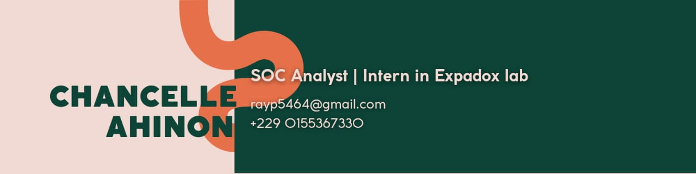

# 🛡️ Chancelle Ahinon | Cybersecurity Portfolio



## 👋 About

Welcome to my personal cybersecurity portfolio.

I am **Chancelle Ahinon**, an aspiring **SOC Analyst and Cybersecurity Engineer** from Benin, passionate about building secure systems through:

- 🛡️ Defensive Security
- 🔍 Threat Detection & Monitoring
- ☁️ Cloud Security
- ⚙️ DevSecOps
- 🤖 AI-powered Security Solutions
- 🔐 Secure Software Development

This portfolio showcases my technical journey, cybersecurity projects, skills, certifications, and hands-on experiences.

---

# 🚀 Features

The portfolio includes:

✅ Modern responsive design  
✅ Cybersecurity-focused UI/UX  
✅ Terminal-inspired identity card  
✅ Project showcase section  
✅ Technical skills overview  
✅ Certifications and training timeline  
✅ Experience and contributions  
✅ Contact section  
✅ Mobile-friendly navigation  
✅ Scroll animations  

---

# 🖥️ Technologies Used

## Frontend

- HTML5
- CSS3
- JavaScript
- Google Fonts
- Remix Icons

## Design

- Responsive layout
- Glassmorphism cards
- Dark cybersecurity theme
- Animated UI components

---

# 📂 Project Structure

# 🛡️ Chancelle Ahinon | Cybersecurity Portfolio


## 👋 About

Welcome to my personal cybersecurity portfolio.

I am **Chancelle Ahinon**, an aspiring **SOC Analyst and Cybersecurity Engineer** from Benin, passionate about building secure systems through:

- 🛡️ Defensive Security
- 🔍 Threat Detection & Monitoring
- ☁️ Cloud Security
- ⚙️ DevSecOps
- 🤖 AI-powered Security Solutions
- 🔐 Secure Software Development

This portfolio showcases my technical journey, cybersecurity projects, skills, certifications, and hands-on experiences.

---

# 🚀 Features

The portfolio includes:

✅ Modern responsive design  
✅ Cybersecurity-focused UI/UX  
✅ Terminal-inspired identity card  
✅ Project showcase section  
✅ Technical skills overview  
✅ Certifications and training timeline  
✅ Experience and contributions  
✅ Contact section  
✅ Mobile-friendly navigation  
✅ Scroll animations  

---

# 🖥️ Technologies Used

## Frontend

- HTML5
- CSS3
- JavaScript
- Google Fonts
- Remix Icons

## Design

- Responsive layout
- Glassmorphism cards
- Dark cybersecurity theme
- Animated UI components

---

# 📂 Project Structure
```
chancelle.github.io/
│
├── index.html
├── style.css
├── script.js
│
├── assets/
│ ├── images/
│ │ ├── preview.png
│ │ ├── favicon.png
│ │ ├── secopsai-dashboard.png
│ │ ├── shieldflow.png
│ │ ├── fireops.png
│ │ └── safesocial.png
│ │
│ └── cv/
│ └── Chancelle_Ahinon_CV.pdf
│
└── README.md
```
---

# 🛡️ Featured Projects

## 🔥 SecOpsAI

**AI-Powered Threat Detection Platform**

A cybersecurity platform combining machine learning and security engineering to detect, enrich, and analyze malicious activity.

### Technologies

- Python
- FastAPI
- Kafka
- Docker
- Prometheus
- Grafana
- Suricata
- Zeek

### Features

- Machine learning threat classification
- Security event streaming
- Real-time monitoring dashboard
- Threat intelligence enrichment
- Secure API architecture

🔗 Repository:  
(Add GitHub link here)

📄 Documentation:  
(Add documentation link here)

---

## ⚙️ ShieldFlow

**DevSecOps Security Pipeline**

A secure CI/CD pipeline integrating automated security checks into the development workflow.

### Technologies

- GitHub Actions
- Semgrep
- Gitleaks
- Trivy
- OWASP ZAP

### Features

- Secret detection
- Vulnerability scanning
- Dependency analysis
- Container security checks

🔗 Repository:  
(Add GitHub link here)

---

## 🔥 FireOps

**Security Monitoring Platform**

A hybrid monitoring architecture designed to provide visibility across cloud and on-premise environments.

### Technologies

- Docker
- Suricata
- Cloud security tools
- Monitoring systems

🔗 Repository:  
(Add GitHub link here)

---

## 🧠 SafeSocial

**AI-Powered Online Safety Platform**

A platform helping teenagers stay safer online through AI-assisted cyberbullying detection, privacy analysis, and safety recommendations.

### Technologies

- React
- TypeScript
- Gemini AI

🔗 Repository:  
(Add GitHub link here)

---

# 🎓 Certifications & Training

## Google Cybersecurity Professional Certificate

Topics covered:

- Security fundamentals
- Linux
- SQL
- Networking
- Threat analysis
- Incident response
- Security operations

Certificate:

(Add certificate link here)

---

## Data Analyst Training

Topics covered:

- Data analysis
- Python
- SQL
- Data visualization
- Data processing

Certificate:

(Add certificate link here)

---

# 🧰 Skills

## Cybersecurity

- SOC Operations
- Threat Detection
- Incident Response
- Network Security
- Vulnerability Assessment
- Security Monitoring
- Threat Intelligence

## Programming

- Python
- C
- JavaScript
- TypeScript
- SQL
- Bash
- HTML/CSS

## Cloud & DevOps

- Docker
- Linux
- Git
- GitHub Actions
- CI/CD
- Virtualization
- Cloud Security

## Security Tools

- Wireshark
- Suricata
- Zeek
- Wazuh
- Trivy
- Semgrep
- OWASP ZAP

## AI & Data

- Machine Learning
- XGBoost
- Feature Engineering
- Model Evaluation
- MLflow
- Data Analysis

---

# 📸 Screenshots

Add project screenshots here:
assets/images/

Examples:

- SecOpsAI Dashboard
- Security Monitoring Interface
- CI/CD Security Pipeline
- AI Application Screenshots

---

# ⚙️ Running Locally

Clone the repository:

```bash
git clone https://github.com/YOUR_USERNAME/YOUR_REPOSITORY.git
```
Navigate into the project:
```
cd portfolio
```
Open:
```
index.html
```
or run a local server:
```
python -m http.server 8000
```
Then visit:
```
http://localhost:8000
```
📬 Contact
Email
rayp5464@gmail.com
LinkedIn
(Add LinkedIn URL)
GitHub
(https://github.com/chancelle5464/)
⭐ Support
If you find this portfolio interesting, feel free to ⭐ the repository or connect with me.
© 2026 Chancelle Ahinon
